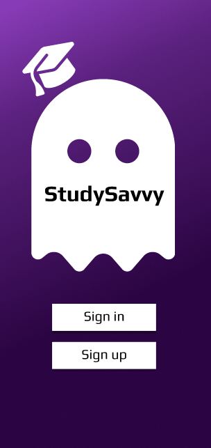
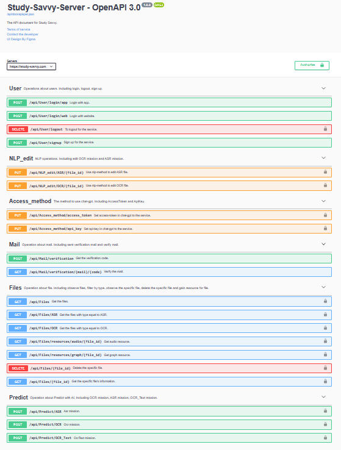

# Study-Savvy-AsyncWork-Celery
## Description the service

> This is the async-work service for [Study-Savvy](#study-savvy).
> 
> The async-work service is produced by [Celery](#celery).
> 
> It will provide a task queue, then the back-end can push task in the task queue.
> 
> Then it also provide some workers to resolve the tasks.
> 
> Task queue can be lots of options, and the project's task queue is using redis.

## Study-Savvy
> Supply main two service
> * Audio content summarize and assistant especially in education zone.
> * Article (from graph or text) content improver by giving some advice especially in high-school student writing.
> 
> Two application
> * App made by Flutter
> * Website made by Next.js
> 
> > ### [Website](https://study-savvy.com)
> > 
> >
> > #### URL : https://study-savvy.com
>
> > ### APP
> > 
> 
> > ### [API document](https://study-savvy.com/api/docs/)
> > 
> >
> > (Image just part of document) 
> > 
> > Details in document can see the [docs/openapi.yaml](./docs/openapi.yaml)
> >
> > or visit the API-Document 
> > 
> > URL : https://study-savvy.com/api/docs/
## Celery

> ### Celery
> Python package for Distributed Task Queue

## Tasks
> ### AsrMission
> At first, This mission will gain task's audio file to execute asr to get its content.
> 
> Then using AES and RSA encryption method to get task's api-key and access-token.
> 
> Finally, try to use chat-gpt to summarize the content in audio file.

> ### OcrMission
> At first, This mission will gain task's graph file to execute ocr to get its content.
> 
> Then using AES and RSA encryption method to get task's api-key and access-token.
> 
> Finally, try to use chat-gpt to judge the content in graph file and give some advice in article.

> ### OcrTextMission
> At first, Using AES and RSA encryption method to get task's api-key and access-token.
> 
> Then try to use chat-gpt to judge the content in task and give some advice in article.
> > This mission like the OcrMission except content to replace the graph file.

> ### NlpEditAsrMission
> At first, Using AES and RSA encryption method to get task's api-key and access-token.
> 
> Then try to use chat-gpt to summarize the content in task.
> > This mission's action is like the AsrMission, but its order is to edit original file's result.

> ### NlpEditOcrMission
> At first, Using AES and RSA encryption method to get task's api-key and access-token.
> 
> Then try to use chat-gpt to judge the content in task and give some advice in article.
> > This mission's action is like the OcrMission, but its order is to edit original file's result.

> ### MailVerificationMission
> At first, generating a random code as validation code.
> 
> Then write and send the email's content with the validation code.
> 
> Finally, Set the pair of code and mail in redis and set validation time.

## AI-Functions
### ASR ( Audio Speech Recognition )
> The Order is to get the content in an audio file.
> 
> 1. #### Splitting audio file.
> 2. #### Using Whisper get the content in the audio file.
> 3. #### Using OpenCC to get traditional content.
>
> `Whisper` is an opensource by openai. And we do some fine-tune at chinese in the model.  
> Can find the whisper's source code and model in the https://github.com/openai/whisper.

### OCR ( Optical Character Recognition )
> The Order is to get the content in a graph file.
> 
> 1. #### Using CRAFT to find line of text in the graph file.
> 2. #### Cropping the image of line of text.
> 3. #### Using TrOCR to get the content the graph file.
>
> `CRAFT` is an opensource the get the position in a graph file.
> 
> And you can see its implement in the https://github.com/clovaai/CRAFT-pytorch
> 
> `TrOCR` is an opensource by Microsoft. And we do some fine-tune it by [open dataset in IAM](https://paperswithcode.com/dataset/iam).
> 
> Can find the source code and model for TrOCR in the https://huggingface.co/microsoft/trocr-large-handwritten. 
## NLP-tools
### Reverse chat-gpt
> This is one of method to use chat-gpt service. To revers chat-gpt and get its reply.
> 
> We will set some prompt for different task and try to prompt the chatting bot.
> 
> Finally, organizing the result by step by step and save in the result. 
### API in openai
> This is one of method to use chat-gpt service. To use api-key to openai to use chat-gpt and get its reply.
> 
> We will set some prompt for different task and try to prompt the chatting bot.
> 
> Finally, organizing the result by step by step and save in the result.

## Encryption
### AES
> In the front-end will set the api-key or access-token encrypted by AES.
> 
> Then we will take the secret-key to decrypt the content for using chat-gpt.
> 
> And the secret-key need to decrypted in RSA.
### RSA
> In the front-end will encrypt the secret-key(for encrypt api-key or access-token) by public-key in RSA.  
> 
> Then we will take the content to decrypt the AES part.